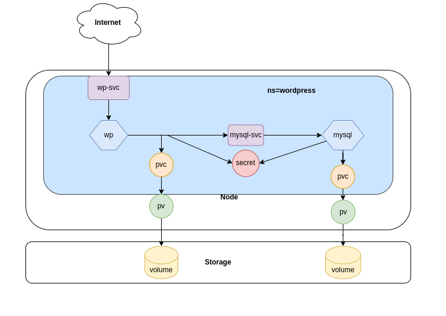

  # Mini Projet Kubernetes
  <div align="center"></div><br/>

  Ce Projet denommé mini projet Kubernetes a été réalisé dans le cadre de mon      parcours **Devops** au **Bootcamp N°15 de EAZYTraining**   
  
  ## Objectifs

 Il s'agit ici de deployer **WordPress** à l'aide manifest selon les informations ci-dessous: 
- Créer un objet de type Deployment pour MySQL avec un seul replicas 
- Créer un objet de type Service de type **clusterIP** pour exposer le **Pod MySQL**
- Créer un objet de type Deployment avec un seul replicas pour **WordPress** avec les paramètres de connexion à **MySQL**
- Les données de WordPress seront stockées dans le répertoire /data du Noeud
- Créer un service de type **NodePort** pour exposer **WordPress**

## Get Started 🚀  

J'ai apporté un changement en ajoutant un **Namespace** pour cloisonner l'application WordPress (voir ci-dessous).

## Architecture 

<div align="center"></div>


## Tâches réalisées
1 - Déploiement de l'environnement k8s

2 - Ecriture des manifests necessaires au deploiemnt de **Wordpress**

3 - Déploiement de **Wordpress**

## Plan de Travail

### 1 - Installation de l'environnement k8s

Comme environnement j'ai opté pour **Minikube et VirtualBox** qui permet d'avoir un cluster Mono Node pour la réalisation de ce projet.

- Téléchargement et installation de **Minikube**
```
mkdir Minikube && cd Minikube
curl -LO https://storage.googleapis.com/minikube/releases/latest/minikube-linux-amd64
sudo install minikube-linux-amd64 /usr/local/bin/minikube
```
- Démarrage de Minikube et Test

```
minikube start --driver=virtualbox
```
```
gbane@dev-ops:~$ kubectl get pods --all-namespaces 
NAMESPACE     NAME                               READY   STATUS      RESTARTS       AGE
kube-system   coredns-5dd5756b68-6ttl7           0/1     Completed   6              3d
kube-system   etcd-minikube                      0/1     Running     7 (84s ago)    3d
kube-system   kube-apiserver-minikube            0/1     Running     7 (74s ago)    3d
kube-system   kube-controller-manager-minikube   0/1     Running     7 (84s ago)    3d
kube-system   kube-proxy-8f5np                   1/1     Running     7 (84s ago)    3d
kube-system   kube-scheduler-minikube            0/1     Running     7 (84s ago)    3d
kube-system   storage-provisioner                1/1     Running     14 (84s ago)   3d

```
L'environnement étant deployé nous procedons à l'écriture de nos manifests

### 2 - Ecriture des Manisfests
**1 - Namespace**

Comme récommendé en environnement de Production  j'ai cloisonné les Pods dans des espaces de nom différent en créant un **Namespace** appelé **wordpress**.
Ce cloisonnement permet d'avoir des unités logiques, allouer des ressources,organiser , gérer et secuiriser le cluster.

Créons le fichier **wp-namespace.yml** et ajoutons le contenu ci-dessous

```
---
apiVersion: v1
kind: Namespace
metadata:
  name: wordpress
status:
  phase: Active
```
```
mkdir -p mini-projet-k8s && cd mini-projet-k8s
touch wp-namespace.yml
```
**2 - Déploiment de MySQL**

À l'instar de  **PostgreSQL**, **Oracle** et autres, **MySQL** est une application à état **(Stateful)** qui nécessite de stocker et suivre des données de façon permanente contrairement aux applications sans état **(Stateless)** comme **Nginx**.

Supposons que nous voulons déployer une base de données **MySQL** dans le **cluster Kubernetes** avec trois **réplicas**. Lorsqu'une application frontale souhaite accéder au cluster MySQL pour lire et écrire des données. La demande de lecture sera transmise à trois pods. Cependant, la demande d'écriture ne sera transmise qu'au **premier Pod (principal)** et les données seront synchronisées avec les autres pods. 

**Pour y parvenir nous allons utiliser des StatefulSets et non des Deployment**

La suppression ou la réduction d'un StatefulSet ne supprimera pas les volumes associés à l'application avec état. Cela nous assure la sécurité de nos données. Si on supprime le Pod MySQL ou si le Pod MySQL redémarre, nous aurons toujours accès aux données du même volume.

Les applications qui se connectent à la base de données devront toujours se connecter au Pod qui joue le rôle principal afin de recevoir un accès en lecture-écriture, ce problème est résolu par le **StatefulSet** en attribuant à chaque pod une identité réseau prévisible et cohérente sous la forme ***<statefulset-name>-<pod-ordinal-index>*** à la différence du **Deployment** qui attribue des noms sous forme ***<deployment-name>-<index aléatoir>***.

Exemple nos 3 replicas seront nommés comme ci-dessous:

- ```mysql-0``` - First Pod, in the primary role
- ```mysql-1``` - Read-only replica
- ```mysql-2``` - Read-only replica

Avant de créer un **StatefulSet** nous devons provisionner un espace de stockage appelé **Volume** pour la persistence des données de notre Base de données.

Pour ce faire nous allons créer un objet de type **PVC (PersistentVolumeClaim)** en utilisant le **HostPath Provisionner** qui est le **StorageClass** installé par défault sur notre cluster .


**a - PVC PersistentVolumeClaim**

Créons le fichier **mysql-pvc.yml** et ajoutons le contenu ci-dessous
- Le fichier
```
touch mysql-pvc.yml
```
- contenu
```
---
apiVersion: v1
kind: PersistentVolumeClaim
metadata:
  name: mysql-pvc
  namespace: wordpress
  labels:
    app: mysql
spec:
  accessModes:
    - ReadWriteOnce
  resources:
    requests:
      storage: 10Gi
```

**b - Secret**

Maintenant que le fichier du volume est crée , nous allons créer un objet de type secret pour stocker les paramètres de connexion **MySQL**. 

*(Dans un environnement de production il est recomendé d'utiliser **HashiCorp Vault)***

Créons le fichier mysql-secret.yml et son contenu, il faut noter que mots de passe doivent être au format **Base64**.

ex: ```echo -n "password"|base64```
- Ficher mysql-secret.yml

```
touch secret-pvc.yml
```
Générons nos mot de passe au format Base64

- contenu 
```
---
apiVersion: v1
kind: Secret
metadata:
  name: mysql-pass
  namespace: wordpress
type: Opaque
data:
  password: eW91cl9zZWN1cmVfcGFzc3dvcmQ=
  mysql-password: cGFzc3dvcmQ=
```

Nous pouvons Maintenant procéder à la création du statefulset.

- Fichier **mysql-sts.yml**
```
touch mysql-sts.yml
```
- Contenu du StatefulSet
```
---
apiVersion: apps/v1
kind: StatefulSet
metadata:
  name: mysql
  namespace: wordpress
  labels:
    app: mysql
spec:
  serviceName: mysql
  selector:
    matchLabels:
      app: mysql
  template:
    metadata:
      labels:
        app: mysql
    spec:
      containers:
      - image: mysql:8.0
        name: mysql
        env:
        - name: MYSQL_ROOT_PASSWORD
          valueFrom:
            secretKeyRef:
              name: mysql-pass
              key: password
        - name: MYSQL_DATABASE
          value: wordpress
        - name: MYSQL_USER
          value: wordpress
        - name: MYSQL_PASSWORD
          valueFrom:
            secretKeyRef:
              name: mysql-pass
              key: password
        ports:
        - containerPort: 3306
          name: mysql
        volumeMounts:
        - name: mysql-persistent-storage
          mountPath: /var/lib/mysql
      volumes:
      - name: mysql-persistent-storage
        persistentVolumeClaim:
          claimName: mysql-pvc

```
