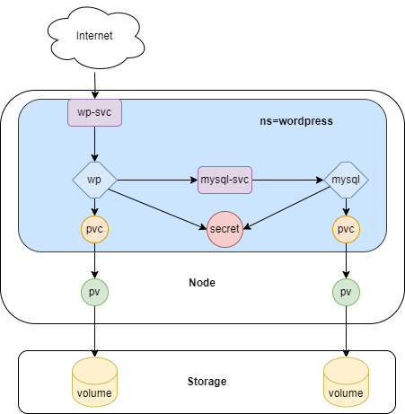

  # Mini Projet Kubernetes
  

 
  Ce Projet denommé mini projet Kubernetes a été réalisé dans le cadre de mon      parcours **Devops** au **Bootcamp N°15 de EAZYTraining**.  
  
  ## Objectifs

 Il s'agit ici de deployer **WordPress** à l'aide manifest selon les informations ci-dessous: 
- Créer un objet de type Deployment pour MySQL avec un seul replicas 
- Créer un objet de type Service de type **clusterIP** pour exposer le **Pod MySQL**
- Créer un objet de type Deployment avec un seul replicas pour **WordPress** avec les paramètres de connexion à **MySQL**
- Les données de WordPress seront stockées dans le répertoire /data du Noeud
- Créer un service de type **NodePort** pour exposer **WordPress**

## Get Started 🚀  

J'ai apporté un changement en ajoutant un **Namespace** pour cloisonner l'application WordPress (voir ci-dessous).

## Architecture 

