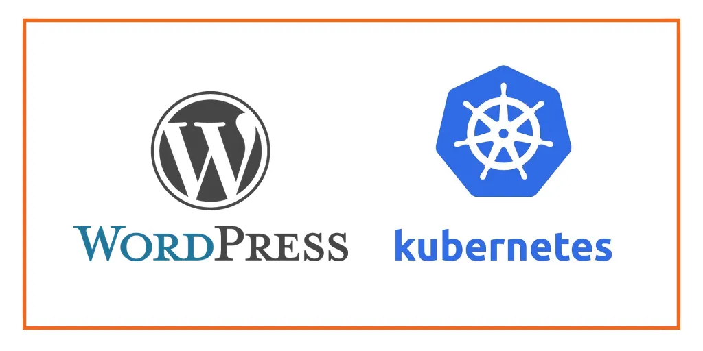
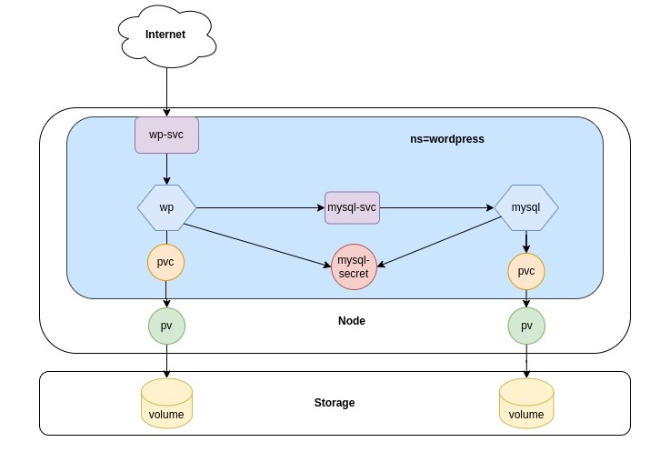
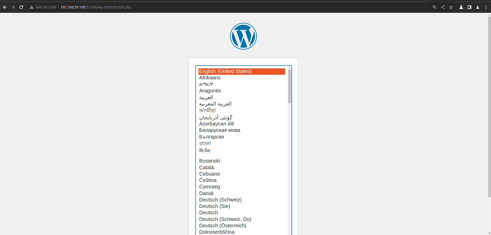
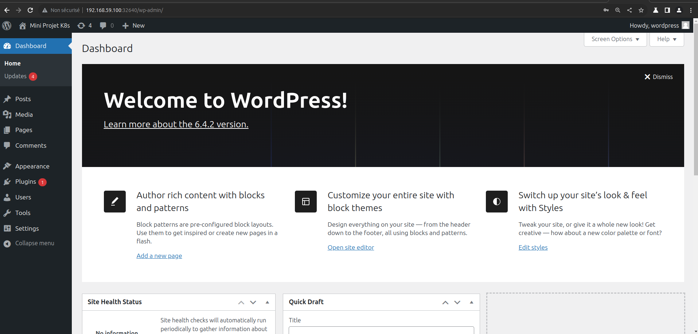

  # Mini Projet Kubernetes
  <div align="center"></div><br/>

  Ce Projet denommé mini projet Kubernetes a été réalisé dans le cadre de ma formation **Devops** durant le **Bootcamp N°15 de EAZYTraining**  d'une durée de 03 mois 
  
  ## Objectifs

 Il s'agit ici de deployer l'application **WordPress** à l'aide manifest selon les informations ci-dessous: 
- Créer un objet Deployment pour MySQL avec un seul replicas 
- Créer un objet Service de type **clusterIP** pour exposer le **MySQL**
- Créer un objet Deployment avec un seul replicas pour **WordPress** avec les paramètres de connexion à **MySQL**
- Créer un volume pour Wordpress 
- Créer un service de type **NodePort** pour exposer **WordPress**

## Get Started 🚀  

J'ai ajouté  un **Namespace** pour cloisonner l'application WordPress (voir Schema ci-dessous).

## Architecture 

<div align="center"></div>

## Plan de Travail
1 - Déploiement de l'environnement k8s

2 - Ecriture des manifests necéssaires au deploiemnt de **MySQL** et de **Wordpress**

3 - Déploiement de **Wordpress**

## Tâches réalisées
### 1 - Installation de l'environnement k8s

Pour simplifier le déploiement j'ai opté pour l'environnement **Minikube et VirtualBox** qui permet d'avoir un cluster Mono Node pour la réalisation du projet.

- Téléchargement et installation de **Minikube**
```
mkdir Minikube && cd Minikube
curl -LO https://storage.googleapis.com/minikube/releases/latest/minikube-linux-amd64
sudo install minikube-linux-amd64 /usr/local/bin/minikube
```
- Démarrage de Minikube et Test

```
minikube start --driver=virtualbox
```
```
gbane@dev-ops:~$ kubectl get pods --all-namespaces 
NAMESPACE     NAME                               READY   STATUS      RESTARTS       AGE
kube-system   coredns-5dd5756b68-6ttl7           0/1     Completed   6              3d
kube-system   etcd-minikube                      0/1     Running     7 (84s ago)    3d
kube-system   kube-apiserver-minikube            0/1     Running     7 (74s ago)    3d
kube-system   kube-controller-manager-minikube   0/1     Running     7 (84s ago)    3d
kube-system   kube-proxy-8f5np                   1/1     Running     7 (84s ago)    3d
kube-system   kube-scheduler-minikube            0/1     Running     7 (84s ago)    3d
kube-system   storage-provisioner                1/1     Running     14 (84s ago)   3d

```
L'environnement étant deployé on peut procéder à l'écriture des manifests

### 2 - Ecriture des Manisfests
**1 - Namespace**

Comme récommendé en environnement de Production  j'ai cloisonné les Pods dans un **Namespace** appelé **wordpress**.
le cloisonnement a l'avantage:
- d'offrir des unités logiques
- de permettre l'allocation de ressources
- d'organiser 
- de gérer et secuiriser le cluster
- etc

Créons le fichier **wp-namespace.yml** et ajoutons le contenu ci-dessous

- Création du fichier 
```
mkdir -p mini-projet-k8s && cd mini-projet-k8s
touch wp-namespace.yml
```
- Contenu à ajouté au fichier
```
---
apiVersion: v1
kind: Namespace
metadata:
  name: wordpress
status:
  phase: Active
```
- Enrégistrons le fichier et procédons à la création du Namespace
```
kubectl apply -f wp-namespace.yml
```
- vérification

```
gbane@dev-ops:~/Bureau/Mini-Projets/K8S/mini-projet-k8s$ kubectl get namespaces 
NAME              STATUS   AGE
default           Active   3d18h
kube-node-lease   Active   3d18h
kube-public       Active   3d18h
kube-system       Active   3d18h
wordpress         Active   28m
```
A partir de cet instant tous nos objets seront crées dans le Namespace **wordpress** en ajoutant la variable **namespace: wordpress** dans le **metadata**

**2 - Déploiment de MySQL**

À l'instar de  **PostgreSQL**, **Oracle** et autres, **MySQL** est une application à état **(Stateful)** qui nécessite de stocker et suivre des données de façon permanente contrairement aux applications sans état **(Stateless)** comme **Nginx**.

Supposons que nous voulons déployer une base de données **MySQL** dans le **cluster Kubernetes** avec trois **réplicas**. Lorsqu'une application frontale souhaite accéder au cluster MySQL pour lire et écrire des données. La demande de lecture sera transmise aux trois pods. Cependant, la demande d'écriture ne sera transmise qu'au **premier Pod (principal)** et les données seront synchronisées avec les autres pods. 

**Pour y parvenir nous allons utiliser objet StatefulSets et non Deployment**

La suppression ou la réduction d'un StatefulSet ne supprimera pas les volumes associés à l'application avec état. Cela nous assure la sécurité de nos données. Si on supprime le Pod MySQL ou si le Pod MySQL redémarre, nous aurons toujours accès aux données du même volume.

Les applications qui se connectent à la base de données devront toujours se connecter au Pod qui joue le rôle principal afin de recevoir un accès en lecture-écriture, ce problème est résolu par le **StatefulSet** en attribuant à chaque pod une identité réseau prévisible et cohérente sous la forme *statefulset-name-pod-ordinal-index* à la différence du **Deployment** qui attribue des noms sous forme *deployment-name-index aléatoir*.

Exemple: nos 3 replicas seront nommés comme ci-dessous:

- ```mysql-0``` - Premier Pod, avec le rôle primary
- ```mysql-1``` - replica en Lecture-seule
- ```mysql-2``` - replica en Lecture-seule

Avant de créer un **StatefulSet** on doit d'abord provisionner un espace de stockage appelé **Volume** pour la persistence des données de notre Base de données.

Pour ce faire on va créer un objet **PVC (PersistentVolumeClaim)** en se basant sur le **HostPath Provisionner** qui est le **StorageClass** installé par défault sur notre cluster .


**a - PVC PersistentVolumeClaim**

- création du fichier **mysql-pvc.yml**
```
touch mysql-pvc.yml
```
- contenu du fichier
```
---
apiVersion: v1
kind: PersistentVolumeClaim
metadata:
  name: mysql-pvc
  namespace: wordpress
  labels:
    app: mysql
spec:
  accessModes:
    - ReadWriteOnce
  resources:
    requests:
      storage: 10Gi
```
- **storage: 10Gi** ici on demande 10Gi de stockage
- **accessModes:** **- ReadWriteOnce** le volume peut être monté en lecture-écriture par un seul nœud.

```
gbane@dev-ops:~/Bureau/Mini-Projets/K8S/mini-projet-k8s$ kubectl apply -f mysql-pvc.yml
persistentvolumeclaim/mysql-pvc created
```
- vérification 
```
gbane@dev-ops:~/Bureau/Mini-Projets/K8S/mini-projet-k8s$ kubectl get pvc -n wordpress 
NAME        STATUS   VOLUME                                     CAPACITY   ACCESS MODES   STORAGECLASS   AGE
mysql-pvc   Bound    pvc-20e435d1-d691-4f0c-a96c-837169c240de   10Gi       RWO            standard       38s
```
```
gbane@dev-ops:~/Bureau/Mini-Projets/K8S/mini-projet-k8s$ kubectl get pv
NAME                                       CAPACITY   ACCESS MODES   RECLAIM POLICY   STATUS        CLAIM                 STORAGECLASS   REASON   AGE
pvc-20e435d1-d691-4f0c-a96c-837169c240de   10Gi       RWO            Delete           Bound         wordpress/mysql-pvc   standard                3h9m
```

**b - Secret**

Maintenant que notre volume est crée , on va créer un objet secret pour stocker les paramètres de connexion **MySQL**. 

*(Dans un environnement de production il est plutôt recomendé d'utiliser **HashiCorp Vault** car les données de type secret sont faciles à décoder)*

Créons le fichier mysql-secret.yml et son contenu, il faut noter que mots de passe doivent être au format **Base64** qu'on peut générer avec la commande ci-dessous

```
echo -n "password"|base64
``` 
- Créons le ficher mysql-secret.yml

```
touch secret-pvc.yml
```
- ajoutons le contenu ci-dessous 
```
---
apiVersion: v1
kind: Secret
metadata:
  name: mysql-pass
  namespace: wordpress
type: Opaque
data:
  password: eW91cl9zZWN1cmVfcGFzc3dvcmQ=
  mysql-password: cGFzc3dvcmQ=
```
- créons et vérifions le secret
```
gbane@dev-ops:~/Bureau/Mini-Projets/K8S/mini-projet-k8s$ kubectl apply -f mysql-secret.yml 
secret/mysql-pass created
```
- vérification
```
gbane@dev-ops:~/Bureau/Mini-Projets/K8S/mini-projet-k8s$ kubectl get -n wordpress secrets 
NAME         TYPE     DATA   AGE
mysql-pass   Opaque   2      153m
```
**c - StatefulSet**

On peut maintenant procéder à la création de l'objet statefulset.

- Création du fichier **mysql-sts.yml**
```
touch mysql-sts.yml
```
- Contenu du StatefulSet
```
---
apiVersion: apps/v1
kind: StatefulSet
metadata:
  name: mysql
  namespace: wordpress
  labels:
    app: mysql
spec:
  serviceName: mysql
  selector:
    matchLabels:
      app: mysql
  replicas: 1
  template:
    metadata:
      labels:
        app: mysql
    spec:
      containers:
      - image: mysql:8.0
        name: mysql
        env:
        - name: MYSQL_ROOT_PASSWORD
          valueFrom:
            secretKeyRef:
              name: mysql-pass
              key: password
        - name: MYSQL_DATABASE
          value: wordpress
        - name: MYSQL_USER
          value: wordpress
        - name: MYSQL_PASSWORD
          valueFrom:
            secretKeyRef:
              name: mysql-pass
              key: password
        ports:
        - containerPort: 3306
          name: mysql
        volumeMounts:
        - name: mysql-persistent-storage
          mountPath: /var/lib/mysql
      volumes:
      - name: mysql-persistent-storage
        persistentVolumeClaim:
          claimName: mysql-pvc
```
Voici quelques points à noter :

1 - **kind: StatefulSet** démande à Kubernetes de créer une application MySQL avec les caractéristiques de **StatefulSet**

2 - **replicas: 1** permettra de créer un seul Pod sera nommé sous le format **statefulset-name-pod-ordinal-index* donc **mysql-0**

3 - **image: mysql:8.0** on demande à kubernetes d'utiliser mysql:8.0 comme image pour l'installation **MySQL** 

4 - **MYSQL_ROOT_PASSWORD et MYSQL_PASSWORD** les mots de passe sont extraits de l'objet **Secret mysql-pass** à l'aide de la reférence **secretKeyRef**.

5 - **volumeMounts et volumes** permettrons au répertoire */var/lib/mysql* du StatefulSet MySQL d'être monté dans le volume **mysql-pvc** qui a été précédemment crée.

à l'aide de la commande kubectl on crée le StatefulSet

```
gbane@dev-ops:~/Bureau/Mini-Projets/K8S/mini-projet-k8s$ kubectl apply -f mysql-sts.yml 
statefulset.apps/mysql created
```
- vérification de la création du statefulset
```
gbane@dev-ops:~/Bureau/Mini-Projets/K8S/mini-projet-k8s$ kubectl get -n wordpress sts
NAME    READY   AGE
mysql   1/1     2m54s
```
- vérification de la création du Pod
```
gbane@dev-ops:~/Bureau/Mini-Projets/K8S/mini-projet-k8s$ kubectl get -n wordpress pods
NAME      READY   STATUS    RESTARTS   AGE
mysql-0   1/1     Running   0          4m18s
```
Comme on le constate notre Pod est nommé **mysql-0** , si on décide de scaler à 03 Pods les autres seront nommés **mysql-1** et **mysql-2**

**d - Service mysql**

Pour permettre la communication entre WordPress et MySQL , on va créer un service de type **clusterIP** qui exposera mysql seulement au niveau du cluster.

- création du fichier mysql-service.yml
```
touch mysql-service.yml
```
- contenu du fichier
```
---
apiVersion: v1
kind: Service
metadata:
  name: mysql-svc
  namespace: wordpress
  labels:
    app: mysql
spec:
  ports:
    - port: 3306
  selector:
    app: mysql
  type: ClusterIP
```
*NB: le **selector** permet d'indexer le pod à exposer*


- création du service **mysql-svc**
```
gbane@dev-ops:~/Bureau/Mini-Projets/K8S/mini-projet-k8s$ kubectl apply -f mysql-service.yml 
service/mysql-svc created
```
- vérification de la création du service
```
gbane@dev-ops:~/Bureau/Mini-Projets/K8S/mini-projet-k8s$ kubectl get -n wordpress svc
NAME        TYPE        CLUSTER-IP       EXTERNAL-IP   PORT(S)    AGE
mysql-svc   ClusterIP   10.111.165.124   <none>        3306/TCP   99s
```
**e - PVC pour WordPress**
- création du fichier wp-pvc.yml
```
touch wp-pvc.yml
```
- contenu du pvc wp-pvc
```
---
apiVersion: v1
kind: PersistentVolumeClaim
metadata:
  name: wp-pvc
  namespace: wordpress
  labels:
    app: wordpress
spec:
  accessModes:
    - ReadWriteOnce
  resources:
    requests:
      storage: 5Gi
```
- création du pvc
```
gbane@dev-ops:~/Bureau/Mini-Projets/K8S/mini-projet-k8s$ kubectl apply -f wp-pvc.yml 
persistentvolumeclaim/wp-pvc created
```
- vérification de la création du persistentVolumeClaim wp-pvc
```
gbane@dev-ops:~/Bureau/Mini-Projets/K8S/mini-projet-k8s$ kubectl get -n wordpress pvc
NAME        STATUS   VOLUME                                     CAPACITY   ACCESS MODES   STORAGECLASS   AGE
mysql-pvc   Bound    pvc-a331213c-7bb4-40be-bbbc-04e5f464017d   10Gi       RWO            standard       160m
wp-pvc      Bound    pvc-4e8a6364-29dc-4324-982a-5f22ec299477   5Gi        RWO            standard       4s
```
**f - wordpress Deployment**

**WordPress** étant une application **Stateless** c'est-à-dire sans état on peut se permettre d'utiliser un objet de type **Deployment**

- création du fichier wp-deployment.yml 
```
touch wp-deployment.yml
```
- contenu du fichier
```
---
apiVersion: apps/v1
kind: Deployment
metadata:
  name: wordpress
  namespace: wordpress
  labels:
    app: wordpress
spec:
  replicas: 1
  selector:
    matchLabels:
      app: wordpress
      tier: frontend
  strategy:
    type: Recreate
  template:
    metadata:
      labels:
        app: wordpress
        tier: frontend
    spec:
      containers:
      - image: wordpress:6.2.1-apache
        name: wordpress
        env:
        - name: WORDPRESS_DB_HOST
          value: mysql-svc
        - name: WORDPRESS_DB_PASSWORD
          valueFrom:
            secretKeyRef:
              name: mysql-pass
              key: password
        - name: WORDPRESS_DB_USER
          value: wordpress
        ports:
        - containerPort: 80
          name: wordpress
        volumeMounts:
        - name: wordpress-persistent-storage
          mountPath: /var/www/html
      volumes:
      - name: wordpress-persistent-storage
        persistentVolumeClaim:
          claimName: wp-pvc

```
Voici quelques points à noter :

1 - **kind: Deployment** démande à Kubernetes de créer une application WordPress avec les caractéristiques **Stateless** , ce **Deployment** va engendrer un **replicaset** qui va s'assurer que le nombre pod souhaité avec l'option **(replicas: 1)** soit toujours présent

2 - **replicas: 1** permettra de créer un seul Pod qui sera nommé sous le format **deployment-name-[a-z0-9]-[a-z0-9]** 

3 - **type: Recreate** dans la partie **strategy** definit la stratégie de déploiement (ici en cas de mise à jour il termine l'ancienne version et deploi la nouvelle version). cette stratégie est idéale en environnement de dévéloppement.

3 - **WORDPRESS_DB_HOST** ici on fournit le nom du service MySQL **mysql-svc** 

4 - **WORDPRESS_DB_PASSWORD** est extrait de l'objet **Secret mysql-pass** à l'aide de la reférence **secretKeyRef**

5 - **image: wordpress:6.2.1-apache** est l'image qui servira à la création du Pod WordPress

6 - **volumeMounts et volumes** permettrons au répertoire /var/www/html du Pod d'être monté dans le volume wp-pvc qui a été précédemment crée.

- création du deployment wordpress
```
gbane@dev-ops:~/Bureau/Mini-Projets/K8S/mini-projet-k8s$ kubectl apply -f wp-deployment.yml 
deployment.apps/wordpress created
```
- vérification de la création du deployment
```
gbane@dev-ops:~/Bureau/Mini-Projets/K8S/mini-projet-k8s$ kubectl get -n wordpress deployments.apps 
NAME        READY   UP-TO-DATE   AVAILABLE   AGE
wordpress   1/1     1            1           107s
```
- vérification de la présence du replicaset
```
gbane@dev-ops:~/Bureau/Mini-Projets/K8S/mini-projet-k8s$ kubectl get -n wordpress rs
NAME                   DESIRED   CURRENT   READY   AGE
wordpress-6f77d9cd7c   1         1         1       7m38s
```
- vérification des pods 
```
gbane@dev-ops:~/Bureau/Mini-Projets/K8S/mini-projet-k8s$ kubectl get -n wordpress pods 
NAME                         READY   STATUS    RESTARTS   AGE
mysql-0                      1/1     Running   0          90m
wordpress-6f77d9cd7c-ltc7v   1/1     Running   0          2m49s
```

**j - Service WordPress**

WordPress devant être accessible depuis le navigateur donc exposer à l'extérieur du cluster , on va créer un service de type **NodePort**  qui va exposer le service sur l'IP de chaque nœud sur un port statique (le NodePort ), ce port sera de la plage **30000-32767**

- Création du fichier wp-svc.yml
```
touch wp-svc.yml
```
- Contenu du fichier wp-svc.yml
```
apiVersion: v1
kind: Service
metadata:
  name: wordpress
  namespace: wordpress
  labels:
    app: wordpress
spec:
  ports:
    - port: 80
  selector:
    app: wordpress
    tier: frontend
  type: NodePort
```

*NB: le **selector** permet d'indexer le pod à exposer*

- Création du service **wordpress**
```
gbane@dev-ops:~/Bureau/Mini-Projets/K8S/mini-projet-k8s$ kubectl apply -f wp-svc.yml 
service/wordpress created
```

- Vérification de la création du service
```
gbane@dev-ops:~/Bureau/Mini-Projets/K8S/mini-projet-k8s$ kubectl get svc -n wordpress 
NAME        TYPE        CLUSTER-IP       EXTERNAL-IP   PORT(S)        AGE
mysql-svc   ClusterIP   10.111.165.124   <none>        3306/TCP       96m
wordpress   NodePort    10.109.242.42    <none>        80:32640/TCP   90s
```
Comme on peut le constater le **port** attribué est **32640** qui en réalité va forwarder les requêtes réçues sur le port 80 du pod.

- **Vérification de l'ensemble de nos objets**
```
gbane@dev-ops:~/Bureau/Mini-Projets/K8S/mini-projet-k8s$ kubectl get all -n wordpress 
NAME                             READY   STATUS    RESTARTS      AGE
pod/mysql-0                      1/1     Running   1 (26m ago)   14h
pod/wordpress-6f77d9cd7c-ltc7v   1/1     Running   1 (26m ago)   13h

NAME                TYPE        CLUSTER-IP       EXTERNAL-IP   PORT(S)        AGE
service/mysql-svc   ClusterIP   10.111.165.124   <none>        3306/TCP       13h
service/wordpress   NodePort    10.109.242.42    <none>        80:32640/TCP   12h

NAME                        READY   UP-TO-DATE   AVAILABLE   AGE
deployment.apps/wordpress   1/1     1            1           13h

NAME                                   DESIRED   CURRENT   READY   AGE
replicaset.apps/wordpress-6f77d9cd7c   1         1         1       13h

NAME                     READY   AGE
statefulset.apps/mysql   1/1     14h
```
## Rémarques
Il faut noter qu'on peut deployer nos manifests d'un seul coup avec un fichier **kustomization.yml** et déclarer les manifests dans l'ordre de deploiement. (voir ci-dessous)

## Déploiement avec kuztomization
- création du fichier kuztomization
```
touch kustomization.yml
```
 - contenu à mettre dans le fichier kustomization.yml
```
resources:
  - wp-namespace.yml
  - mysql-secret.yml
  - mysql-pvc.yml
  - mysql-sts.yml
  - mysql-service.yml
  - wp-pvc.yml
  - wp-deployment.yml
  - wp-svc.yml
```
- Déploiement avec kuztomization
```
gbane@dev-ops:~/Bureau/Mini-Projets/K8S/mini-projet-k8s$ kubectl apply -k ./
namespace/wordpress created
secret/mysql-pass created
service/mysql-svc created
service/wordpress created
persistentvolumeclaim/mysql-pvc created
persistentvolumeclaim/wp-pvc created
deployment.apps/wordpress created
statefulset.apps/mysql created
```
- Résultat 
```
gbane@dev-ops:~/Bureau/Mini-Projets/K8S/mini-projet-k8s$ kubectl get all -n wordpress 
NAME                             READY   STATUS    RESTARTS   AGE
pod/mysql-0                      1/1     Running   0          64s
pod/wordpress-6f77d9cd7c-bbp9c   1/1     Running   0          64s

NAME                TYPE        CLUSTER-IP       EXTERNAL-IP   PORT(S)        AGE
service/mysql-svc   ClusterIP   10.104.73.82     <none>        3306/TCP       64s
service/wordpress   NodePort    10.106.192.101   <none>        80:30390/TCP   64s

NAME                        READY   UP-TO-DATE   AVAILABLE   AGE
deployment.apps/wordpress   1/1     1            1           64s

NAME                                   DESIRED   CURRENT   READY   AGE
replicaset.apps/wordpress-6f77d9cd7c   1         1         1       64s

NAME                     READY   AGE
statefulset.apps/mysql   1/1     64s
```

- Test de l'application via le Navigateur

- Déterminons l'Url de l'application
```
gbane@dev-ops:~/Bureau/Mini-Projets/K8S/mini-projet-k8s$ minikube service wordpress -n wordpress --url
http://192.168.59.100:32640
```
<div align="center"></div><br>
<br><br>

<div align="center"></div>

## Conclusion
Ce Mini projet a été très enrichissant car il m'a permit de mettre en oeuvre un cas patrique et approfondir mes connaissances. 
Ce fut aussi l'occasion de nouvelles decouvertes et d'une meilleure compréhension de l'environnement kubernetes .
